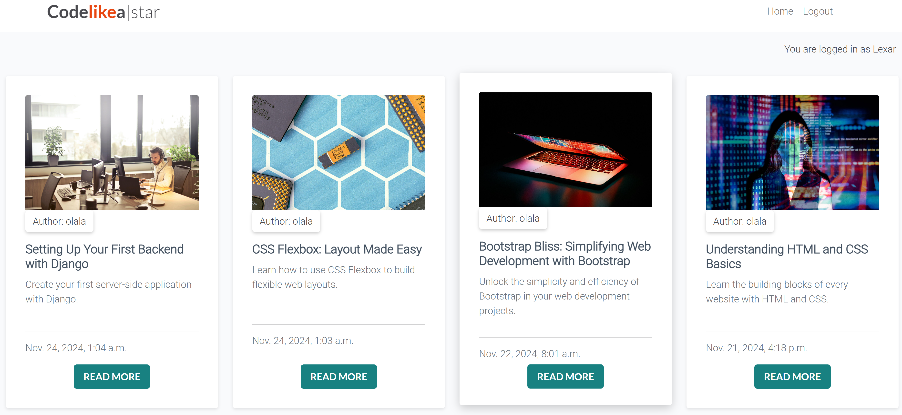
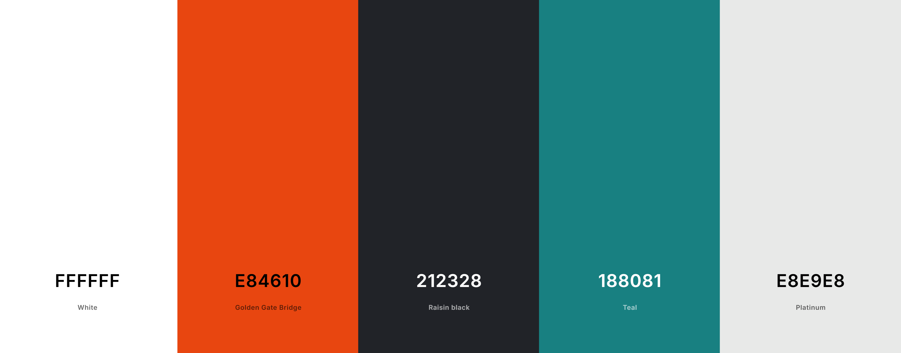
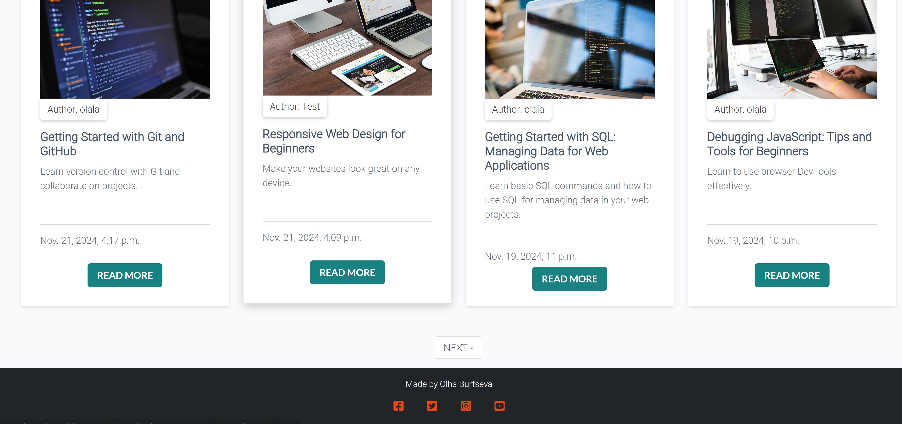
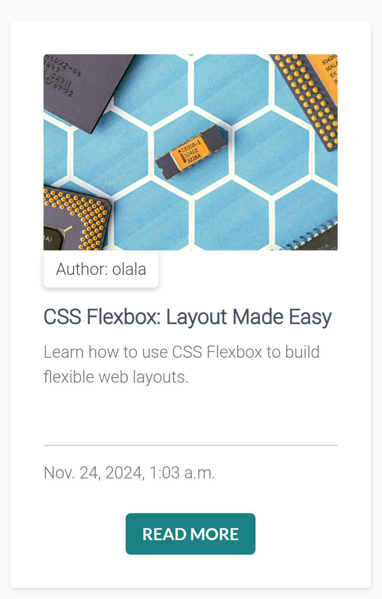

# CODE*LIKE*A|STAR

## Project Description

**Django Tech Blog** is a dynamic web application built using Django, designed for sharing and discussing tech-related articles. The blog features a clean and user-friendly interface where visitors can explore articles on a variety of technology topics such as programming, software development, and industry trends.

Users can read posts and see comments and likes, while registered users can write comments and like posts. The blog supports a simple authentication system, enabling users to log in, register, and manage their content.

This project demonstrates key Django functionalities such as CRUD operations, user authentication, and responsive design. It's hosted on Heroku and can be accessed through the following link: [Django Tech Blog](https://django-blog-olala24-40833ad3822c.herokuapp.com/).

## Table of contents

1. [UI/UX](#uiux)
2. [Features](#features)
3. [Features Left to Implement](#left)
4. [Technology Used](#tech)
5. [Testing](#testing)
6. [Bugs](#bugs)
7. [Deployment](#deployment)
8. [Credits](#credits)
9. [Content](#content)
10. [Acknowledgements](#acknowledgements)

## UI/UX 

The user interface of this blog was designed with simplicity and ease of use in mind, ensuring a smooth and enjoyable browsing experience. The layout is responsive, adapting seamlessly across various devices, from desktop to mobile. To create a cohesive and appealing aesthetic, the color palette was generated using [Coolors.co](https://coolors.co). This tool helped select a modern and complementary set of colors that enhance the readability and overall user experience.

## Features 

Key features of this blog include:

- **Post Block Layout**: The homepage displays 8 post blocks per page, each consisting of the author, title, excerpt, and publication date. Each post opens in a new window with a unique URL slug.

- **Homepage Post List**: Posts are shown in reverse chronological order, with a "Read More" button leading to the full post.

- **Draft Posts**: Admins can create, save, and manage draft posts, which are hidden from regular users.
- **User Registration**: Users can register an account to comment and like posts, with feedback on registration status.
- **Post Management**: Admins can create, read, update, and delete posts, with a dedicated "Manage Posts" section.
- **Post Detail View**: Clicking on a post title or "Read More" shows the full content, likes, and comments.
- **Comments**: Users can leave comments on posts, with validation for empty or invalid submissions.
- **Like Counter**: Users and admins can view and interact with the like counter for each post.
- **Pagination**: Posts are paginated, with controls for navigating through multiple pages of content.

### Agile Methodology

This project followed an Agile development approach, using GitHub Projects and Issues to efficiently manage tasks and adapt to changes. User stories were prioritized based on the MoSCoW method, ensuring that development efforts were focused on delivering the most important features first:

- **Must Have**: Core requirements essential for the project's success.
- **Should Have**: Important features, prioritized after the core requirements.
- **Could Have**: Additional features that enhance functionality, provided time permits.
- **Won't Have**: Features deferred for future consideration.

The project utilized a Kanban board to track tasks across three primary stages, ensuring a smooth and organized development process:

- **To Do**: Tasks identified and planned for the project.
- **In Progress**: Tasks currently being developed.
- **Done**: Tasks that have been fully tested and merged into the main codebase.

For a detailed overview of the project's progress, please refer to the [Kanban Board](https://github.com/users/Olala2024/projects/4).

## Features Left to Implement 

- Enabling users to create detailed accounts with possibility to upload profile photo.
- Allowing users to become authors and contribute their own articles.
- Implementing advanced tagging and search capabilities.

## Technology Used 

This project utilizes a combination of modern web technologies to deliver a dynamic and responsive blogging platform. The following technologies were employed:

- **Django**: A high-level Python web framework that powers the backend of the application. Django handles routing, database management, user authentication, and other server-side operations.
- **JavaScript**: A versatile programming language used to enhance the frontend with dynamic features, such as enabling user interactions with likes, comments, and other interactive elements.
- **PostgreSQL**: A robust, open-source relational database management system used as the primary database for storing blog content, user data, and comments.
- **SQLite**: A lightweight, file-based database used during development and testing to simulate database interactions before deploying to production.
- **HTML5**: The latest version of HTML, used for structuring the content and layout of web pages, ensuring semantic markup and improved accessibility.
- **CSS3**: A styling language that defines the visual presentation of the site, including layout, colors, fonts, and responsiveness, to ensure the blog is mobile-friendly across various devices.
- **Bootstrap**: A popular open-source front-end framework that facilitates responsive web design and provides ready-to-use components for a seamless user experience.
- **Heroku**: A platform-as-a-service (PaaS) used to deploy the application to the cloud, enabling easy scalability and remote access to the live site.
- **W3C HTML Validator**: A tool used to validate the HTML markup for compliance with web standards and to ensure proper structure and error-free code.
- **W3C CSS Validator**: A tool used to check the CSS for errors and validate that the stylesheets meet modern web standards.
- **Git**: A distributed version control system that tracks changes to the codebase, enabling collaboration and maintaining version history.
- **GitHub**: A web-based Git repository hosting service that facilitates code collaboration, version control, and deployment.

## Testing 

### Manual Testing

- **User Authentication**: Tested the registration, login, and logout functionality to ensure proper user authentication.
- **Article Interaction**: Verified that users can read, comment, and like articles, while only the superuser can create and edit them.
- **Responsive Design**: Ensured the website is mobile-friendly and displays correctly across different devices.
- **Database**: Checked that the database updates correctly when users interact with articles (e.g., liking or commenting).

### Unit Testing

- **Model Tests**: Tested the models to ensure that the database records were being created and retrieved as expected.

### Validation Testing

- **Form Validation**: Ensured that the forms for user registration, login, and article creation functioned properly, including correct validation and error messages.

## Bugs 

**Known Issues:**

- After deployment, I discovered an issue with the styling of notification messages. Unfortunately, due to time constraints, I was unable to resolve this issue before the project deadline. It remains on the list of things to fix in the future.

**Reporting Bugs:**

- If you encounter any bugs or issues, please report them by opening an issue on the [GitHub Issues page](https://github.com/Olala2024/Django-blog-project-4/issues). Include a detailed description of the problem, steps to reproduce it, and any error messages you receive.

## Deployment 

The project was deployed using [Heroku](https://www.heroku.com). The steps to deploy are as follows:

1. Push the code to the GitHub repository.
2. Set up a Heroku app and connect it to the GitHub repository.
3. Configure the necessary environment variables (such as database credentials).
4. Deploy the app to Heroku from the GitHub repository.

Once deployed, the site should be live at: [https://django-blog-olala24-40833ad3822c.herokuapp.com/](https://django-blog-olala24-40833ad3822c.herokuapp.com/)
This deployment section provides the steps and includes the link to your live site. Let me know if

## Credits 

The following resources were used to enhance the functionality and design of this project:

- **[favicon.io](https://favicon.io)**: Used to generate custom favicons for the blog.
- **[Google Fonts](https://fonts.google.com)**: Used to import web fonts for improved typography and readability.
- **[Bootstrap](https://getbootstrap.com)**: A front-end framework used for building the responsive layout and ensuring a mobile-friendly design.
- **[Font Awesome CSS](https://fontawesome.com)**: Used to include icons for enhancing the visual appearance of the blog.

- The photos used in the blog posts were sourced from [Pexels](https://www.pexels.com).
- A special thanks to [ChatGPT](https://openai.com/chatgpt) for the invaluable assistance in troubleshooting and offering helpful suggestions throughout the development process.
- I would also like to acknowledge the helpful resources provided in this [YouTube Playlist](https://www.youtube.com/playlist?list=PL_KegS2ON4s580mS3nPt5x_eu6kO2cvOc), which provided guidance on various aspects of web development.
- Additionally, thanks to [Codemy.com YouTube Channel](https://www.youtube.com/@Codemycom/playlists) for providing helpful tutorials that assisted with the development process.

## Content 

The articles featured on the blog were generated by [OpenAI](https://openai.com) and sourced from the educational materials provided by [Code Institute](https://codeinstitute.net). These articles cover a variety of tech-related topics, offering insights and discussions on programming, web development, and best practices in the tech industry.

The content was curated to provide value to readers looking to learn and stay updated on the latest trends and methodologies in the world of technology.

## Acknowledgements 

- I extend heartfelt gratitude to my mentor, Ronan McClelland, for his constant encouragement, support, and guidance throughout this project.
- A huge thank you to [Code Institute](https://codeinstitute.net) for providing valuable guidance and the "I Think Therefore I Blog" lessons, which were fundamental in shaping this project.
