# CODE*LIKE*A|STAR

## Project Description

**Django Tech Blog** is a dynamic web application built using Django, designed for sharing and discussing tech-related articles. The blog features a clean and user-friendly interface where visitors can explore articles on a variety of technology topics such as programming, software development, and industry trends.

Users can read posts and see comments and likes, while registered users can write comments and like posts. The blog supports a simple authentication system, enabling users to log in, register, and manage their content.

This project demonstrates key Django functionalities such as CRUD operations, user authentication, and responsive design. It's hosted on Heroku and can be accessed through the following link: [Django Tech Blog](https://django-blog-olala24-40833ad3822c.herokuapp.com/).

## Table of contents

1. [About](#about)
2. [User Stories](#user-stories)
3. [UI/UX](#uiux)
   - [Colours](#colours)
   - [Database](#database)
   - [Wireframes](#wireframes)
4. [Features](#features)
5. [Features Left to Implement](#left)
6. [Technologies Used](#tech)
7. [Validation](#validation)
8. [Testing](#testing)
   - [Manual Testing](#manual-testing)
   - [Automated Testing](#automated-testing)
9. [Bugs](#bugs)
10. [Heroku Deployment](#deployment)
11. [Credits](#credits)
12. [Acknowledgements](#acknowledgements)

## About 

**Django Tech Blog** is a platform for tech enthusiasts to share and discuss articles on various technology topics. The blog allows users to read, comment, and like posts, while registered users can contribute their own comments and likes. The project showcases Django's capabilities in building a full-featured web application with user authentication, CRUD operations, and responsive design.

## User Stories 

- As a Site User, I can view a list of posts so that I can select one to read.
- As a Site Admin, I can create draft posts so that I can finish writing the content later.
- As a Site User, I can register an account so that I can comment and like.
- As a Site Admin, I can create, read, update, and delete posts so that I can manage my blog content.
- As a Site User, I can click on a post so that I can read the full text.
- As a Site User, I can leave comments on a post so that I can be involved in the conversation.
- As a Site User, I can like or unlike a post so that I can interact with the content.
- As a Site User / Admin, I can view the number of likes on each post so that I can see which is the most popular or viral.
- As a Site User / Admin, I can view comments on an individual post so that I can read the conversation.
- As a Site Admin, I can approve or disapprove comments so that I can filter out objectionable comments.
- As a Site User, I can view a paginated list of posts so that I can easily browse through the blog's content.
- As a visitor, I want to contact the blog owner via a contact form.
- As a visitor, I want to browse posts by categories.

## UI/UX 

### Colours 

The color palette for the blog was generated using [Coolors.co](https://coolors.co). This tool helped select a modern and complementary set of colors that enhance the readability and overall user experience.

### Database 

The database schema for the blog includes the following tables:
- Users
- Categories
- Posts
- Comments
- Contacts

The relationships between these tables are visualized on this diagram:
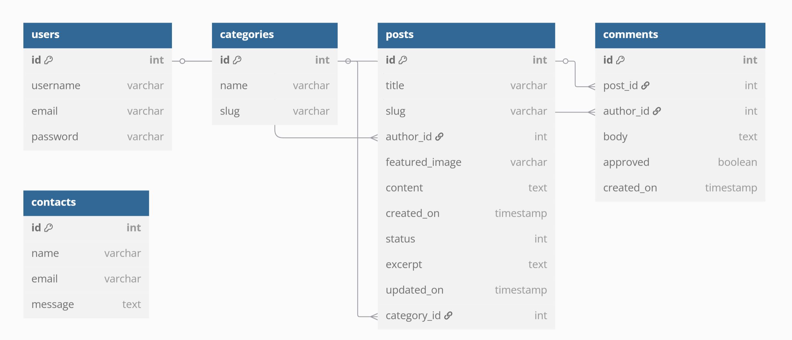

### Wireframes 

Wireframes were created using [MockFlow](https://app.mockflow.com/) to plan the layout and structure of the blog. These wireframes guided the development process and ensured a consistent design across different pages.

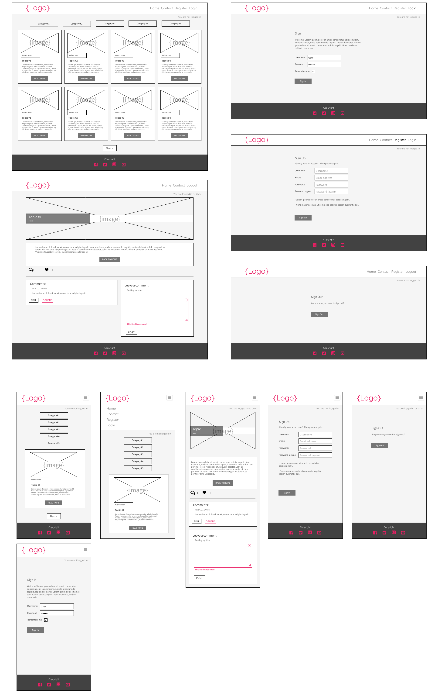

## Features 

Key features of this blog include:

- **Post Block Layout**: The homepage displays 8 post blocks per page, each consisting of the author, title, excerpt, and publication date. Each post opens in a new window with a unique URL slug.

- **Homepage Post List**: Posts are shown in reverse chronological order, with a "Read More" button leading to the full post.

- **Draft Posts**: Admin has admin panel and can create, save, and manage draft posts, which are hidden from regular users.

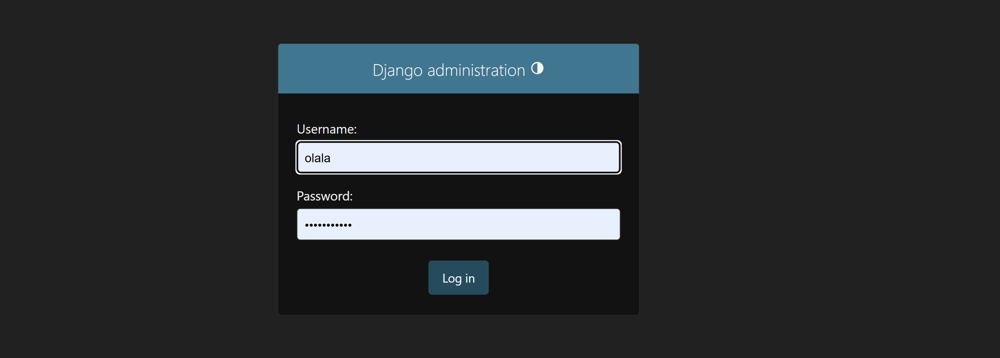

- **User Registration**: Users can register an account to comment and like posts, with feedback on registration status.

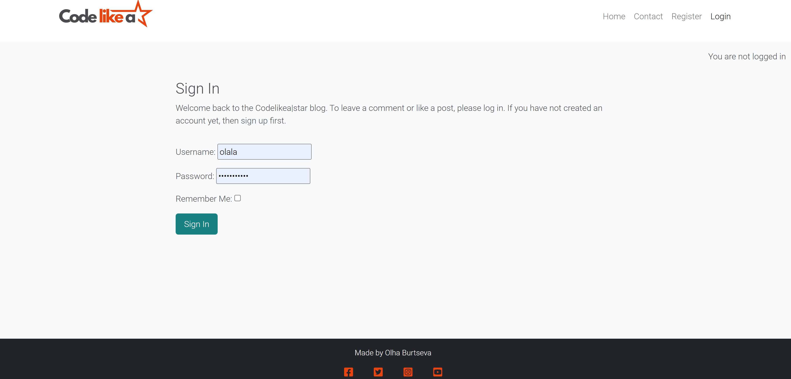

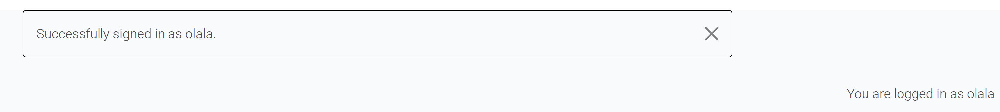

- **Post Detail View**: Clicking on a post title or "Read More" shows the full content, likes, and comments.

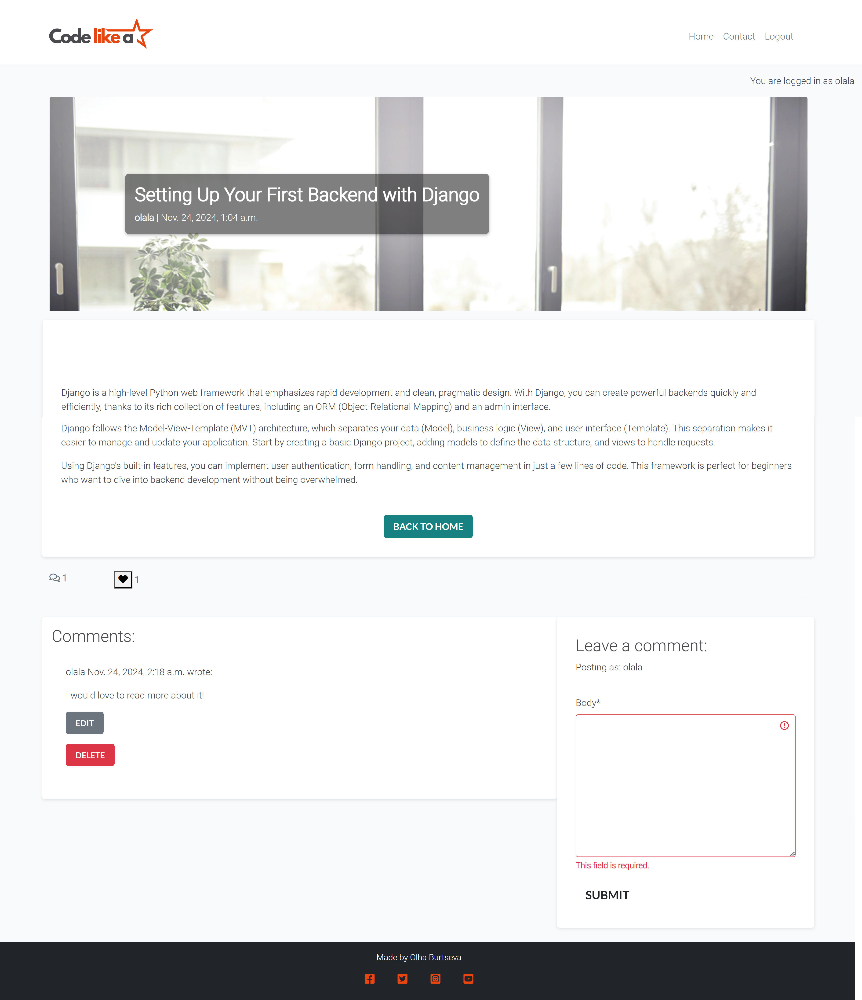

- **Comments**: Users can leave comments on posts, with validation for empty or invalid submissions.

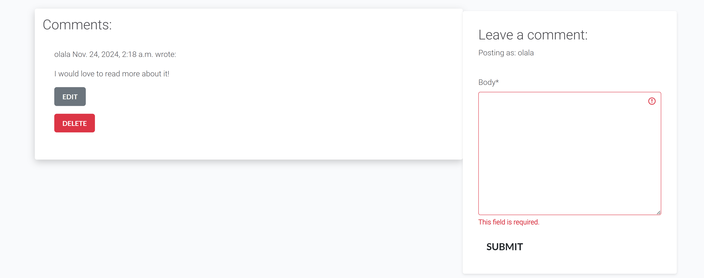

- **Like Counter**: Users and admins can view and interact with the like counter for each post.

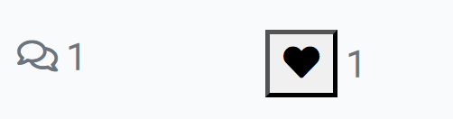

- **Pagination**: Posts are paginated, with controls for navigating through multiple pages of content.

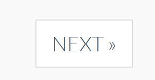
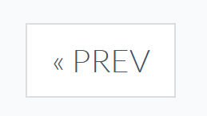

### Agile Methodology

This project followed an Agile development approach, using GitHub Projects and Issues to efficiently manage tasks and adapt to changes. User stories were prioritized based on the MoSCoW method, ensuring that development efforts were focused on delivering the most important features first:

- **Must Have**: Core requirements essential for the project's success.
- **Should Have**: Important features, prioritized after the core requirements.
- **Could Have**: Additional features that enhance functionality, provided time permits.
- **Won't Have**: Features left for future consideration.

The project utilized a Kanban board to track tasks across three primary stages, ensuring a smooth and organized development process:

- **To Do**: Tasks identified and planned for the project.
- **In Progress**: Tasks currently being developed.
- **Done**: Tasks that have been fully tested and merged into the main codebase.

For a detailed overview of the project's progress, please refer to the [Kanban Board](https://github.com/users/Olala2024/projects/4).

## Features Left to Implement 

- Enabling users to create detailed accounts with possibility to upload profile photo.
- Allowing users to become authors and contribute their own articles.
- Implementing advanced tagging and search capabilities.

## Technologies Used 

This project utilizes a combination of modern web technologies to deliver a dynamic and responsive blogging platform. The following technologies were employed:

- **Django**: A high-level Python web framework that powers the backend of the application. Django handles routing, database management, user authentication, and other server-side operations.
- **JavaScript**: A versatile programming language used to enhance the frontend with dynamic features, such as enabling user interactions with likes, comments, and other interactive elements.
- **PostgreSQL**: A robust, open-source relational database management system used as the primary database for storing blog content, user data, and comments.
- **HTML5**: The latest version of HTML, used for structuring the content and layout of web pages, ensuring semantic markup and improved accessibility.
- **CSS3**: A styling language that defines the visual presentation of the site, including layout, colors, fonts, and responsiveness, to ensure the blog is mobile-friendly across various devices.
- **Bootstrap**: A popular open-source front-end framework that facilitates responsive web design and provides ready-to-use components for a seamless user experience.
- **Heroku**: A platform-as-a-service (PaaS) used to deploy the application to the cloud, enabling easy scalability and remote access to the live site.
- **W3C HTML Validator**: A tool used to validate the HTML markup for compliance with web standards and to ensure proper structure and error-free code.
- **W3C CSS Validator**: A tool used to check the CSS for errors and validate that the stylesheets meet modern web standards.
- **Git**: A distributed version control system that tracks changes to the codebase, enabling collaboration and maintaining version history.
- **GitHub**: A web-based Git repository hosting service that facilitates code collaboration, version control, and deployment.

## Validation 

### HTML Validation

The HTML code was validated using the [W3C HTML Validator](https://validator.w3.org/).
The validation test results indicate that the `base.html` file is compliant with web standards and best practices. No further issues were found.

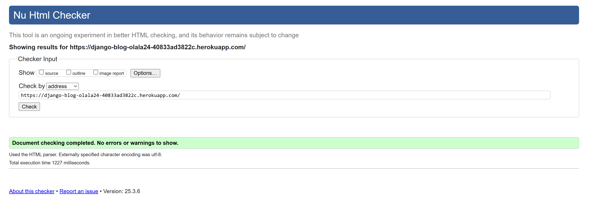

### CSS Validation

The CSS code was validated using the [W3C CSS Validator](https://jigsaw.w3.org/css-validator/).
The validation test results indicate that the CSS code is compliant with web standards and best practices. No errors were found.

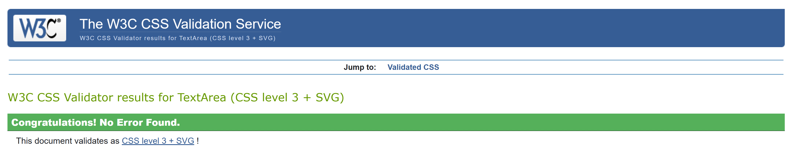

## Testing 

### Manual Testing 

| User Story | Acceptance Criteria | Result |
|------------|---------------------|--------|
| As a Site User, I can view a list of posts so that I can select one to read. | Posts are displayed in a list format on the homepage. Each post includes a title, a brief excerpt, and a "Read More" button. Posts are sorted in reverse chronological order by default. | I have checked the homepage and performed actions to view the list of posts. Each post is displayed with a title, a brief excerpt, and a "Read More" button. The posts are sorted in reverse chronological order by default. |
| As a Site Admin, I can create draft posts so that I can finish writing the content later. | Admins can save posts as "Draft" instead of publishing them immediately. Drafts are listed in the "Manage Posts" section with a "Draft" label. Draft posts are not visible to regular users. | I have checked the "Manage Posts" section and performed actions to create draft posts. Admins can save posts as "Draft" and these drafts are listed with a "Draft" label. Draft posts are not visible to regular users. |
| As a Site User, I can register an account so that I can comment and like. | The site includes a "Register" page with fields for username, email, and password. Users receive feedback if the registration fails. Successful registration redirects users to the homepage. | I have checked the registration process and performed actions to register an account. The "Register" page includes fields for username, email, and password. Users receive feedback if the registration fails. Successful registration redirects users to the homepage. |
| As a Site Admin, I can create, read, update, and delete posts so that I can manage my blog content. | Admins see a "Manage Posts" section with options to create, edit, and delete posts. Deleted posts are permanently removed from the database. Only admins can access the management interface. | I have checked the "Manage Posts" section and performed actions to create, read, update, and delete posts. Admins can access the management interface and perform these actions. Deleted posts are permanently removed from the database. |
| As a Site User, I can click on a post so that I can read the full text. | Clicking a post title or "Read More" button opens a detailed view of the post. The post page displays the full title, content, publish date, likes, and comments (if enabled). | I have checked the post interaction and performed actions to click on a post title or "Read More" button. This opens a detailed view of the post displaying the full title, content, publish date, likes, and comments (if enabled). |
| As a Site User, I can leave comments on a post so that I can be involved in the conversation. | Logged-in users see a comment form on the detailed post view. Comments are saved to the database and displayed in the comments section. Invalid or empty comments trigger a feedback message. | I have checked the commenting functionality and performed actions to leave comments on a post. Logged-in users see a comment form on the detailed post view. Comments are saved to the database and displayed in the comments section. Invalid or empty comments trigger a feedback message. |
| As a Site User, I can like or unlike a post so that I can interact with the content. | Logged-in users see a "Like" button on each post. Clicking "Like" increases the like counter and toggles the button to "Unlike." Clicking "Unlike" decreases the like counter and reverts the button to "Like." | I have checked the like functionality and performed actions to like and unlike posts. Logged-in users see a "Like" button on each post. Clicking "Like" increases the like counter and toggles the button to "Unlike." Clicking "Unlike" decreases the like counter and reverts the button to "Like." |
| As a Site User / Admin, I can view the number of likes on each post so that I can see which is the most popular or viral. | Each post displays a like counter in the list and detailed views. The like counter updates dynamically when likes are added or removed. | I have checked the like counter and performed actions to view the number of likes on each post. Each post displays a like counter in the list and detailed views. The like counter updates dynamically when likes are added or removed. |
| As a Site User / Admin, I can view comments on an individual post so that I can read the conversation. | The detailed post view includes a comments section. Comments are displayed in reverse chronological order with the commenter’s name and timestamp. | I have checked the comments section and performed actions to view comments on an individual post. The detailed post view includes a comments section. Comments are displayed in reverse chronological order with the commenter’s name and timestamp. |
| As a Site Admin, I can approve or disapprove comments so that I can filter out objectionable comments. | Admins see a list of unapproved comments in the "Manage Comments" section. Admins can approve or delete comments from this list. | I have checked the comment approval functionality and performed actions to approve or disapprove comments. Admins see a list of unapproved comments in the "Manage Comments" section. Admins can approve or delete comments from this list. |
| As a Site User, I can view a paginated list of posts so that I can easily browse through the blog's content. | Posts are displayed in pages, with a limited number of posts per page. Pagination controls (e.g., "Next" and "Previous") are visible and functional. Posts are sorted in reverse chronological order. | I have checked the pagination functionality and performed actions to view a paginated list of posts. Posts are displayed in pages, with a limited number of posts per page. Pagination controls (e.g., "Next" and "Previous") are visible and functional. Posts are sorted in reverse chronological order. |
| As a visitor, I want to contact the blog owner via a contact form. | Visitors should be able to fill out and submit a contact form. The form should include fields for name, email, and message. Visitors should be able to submit the form. The blog owner should receive the submitted messages. | I have checked the contact form functionality and performed actions to fill out and submit the form. The form includes fields for name, email, and message. Visitors can submit the form. The blog owner receives the submitted messages. |
| As a visitor, I want to browse posts by categories. | Categories should be displayed on the website. Visitors should be able to click on a category to view posts within that category. The posts should be filtered based on the selected category. | I have checked the category browsing functionality and performed actions to browse posts by categories. Categories are displayed on the website. Visitors can click on a category to view posts within that category. The posts are filtered based on the selected category. |

### Automated Testing 

The following tests were performed to ensure the functionality of the comment form in the blog application:

1. **test_valid_comment_submission**: This test checks if a valid comment submission redirects correctly and the comment is saved in the database.
   - **Result**: Passed
   - **Description**: I performed actions to submit a valid comment. The response status code was 302 (redirect), and the comment was successfully saved in the database.

2. **test_invalid_comment_submission**: This test checks if an invalid comment submission (empty body) does not save the comment and returns a 200 status code.
   - **Result**: Passed
   - **Description**: I performed actions to submit an invalid comment (empty body). The response status code was 200, and the comment was not saved in the database.

3. **test_comment_form_valid**: This test checks if the `CommentForm` is valid when provided with valid data.
   - **Result**: Passed
   - **Description**: I provided valid data to the `CommentForm`. The form was valid.

4. **test_comment_form_invalid**: This test checks if the `CommentForm` is invalid when provided with invalid data (empty body).
   - **Result**: Passed
   - **Description**: I provided invalid data (empty body) to the `CommentForm`. The form was invalid.

5. **test_comment_form_submission_redirect**: This test checks if a valid comment submission redirects to the post detail page.
   - **Result**: Passed
   - **Description**: I performed actions to submit a valid comment. The response redirected to the post detail page.

6. **test_comment_form_submission_renders_post_detail**: This test checks if an invalid comment submission renders the post detail template and displays an error message.
   - **Result**: Passed
   - **Description**: I performed actions to submit an invalid comment (empty body). The response rendered the post detail template and displayed an error message indicating that the field is required.

### Test for Contact Form Submission

The following tests were performed to ensure the functionality of the contact form in the blog application:

#### TestContactFormSubmission

This test case verifies the behavior of the contact form submission, including both valid and invalid submissions.

1. **test_contact_form_submission**: This test checks if a valid contact form submission redirects correctly.
   - **Result**: Passed
   - **Description**: I performed actions to submit a valid contact form. The response status code was 302 (redirect), and the form was successfully submitted.

2. **test_invalid_contact_form_submission**: This test checks if an invalid contact form submission (empty name) does not redirect and displays the appropriate error message.
   - **Result**: Passed
   - **Description**: I performed actions to submit an invalid contact form (empty name). The response status code was 200, and the form displayed the error message "This field is required."

### Summary

All tests passed successfully, indicating that the comment form and contact form functionalities are working as expected. The tests covered various scenarios, including valid and invalid submissions, form validation, and proper redirection and error handling.

## Bugs 

**Known Issues:**

- - A bug was found in the contact form where validation errors were not being displayed correctly. This issue was fixed by updating the `contact.html` template to ensure that form errors are displayed.

**Reporting Bugs:**

- If you encounter any bugs or issues, please report them by opening an issue on the [GitHub Issues page](https://github.com/Olala2024/Django-blog-project-4/issues). Include a detailed description of the problem, steps to reproduce it, and any error messages you receive.

## Heroku Deployment 

The project was deployed using [Heroku](https://www.heroku.com). The steps to deploy are as follows:

1. Push the code to the GitHub repository.
2. Set up a Heroku app and connect it to the GitHub repository.
3. Configure the necessary environment variables (such as database credentials).
4. Deploy the app to Heroku from the GitHub repository.

Once deployed, the site should be live at: [https://django-blog-olala24-40833ad3822c.herokuapp.com/](https://django-blog-olala24-40833ad3822c.herokuapp.com/)

## Credits 

The following resources were used to enhance the functionality and design of this project:

- **[favicon.io](https://favicon.io)**: Used to generate custom favicons for the blog.
- **[Google Fonts](https://fonts.google.com)**: Used to import web fonts for improved typography and readability.
- **[Bootstrap](https://getbootstrap.com)**: A front-end framework used for building the responsive layout and ensuring a mobile-friendly design.
- **[Font Awesome CSS](https://fontawesome.com)**: Used to include icons for enhancing the visual appearance of the blog.
- **[Canva](https://www.canva.com/)**: Used to create the logo for the blog.

- **[Code Institute](https://codeinstitute.net)**: Lessons provided by Code Institute in section "I Think Therefore I Blog" that were fundamental in shaping this project.
- The photos used in the blog posts were sourced from [Pexels](https://www.pexels.com).
- A special thanks to [ChatGPT](https://openai.com/chatgpt) for the invaluable assistance in troubleshooting and offering helpful suggestions throughout the development process.
- I would also like to acknowledge the helpful resources provided in this [YouTube Playlist](https://www.youtube.com/playlist?list=PL_KegS2ON4s580mS3nPt5x_eu6kO2cvOc), which provided guidance on various aspects of web development.
- Additionally, thanks to [Codemy.com YouTube Channel](https://www.youtube.com/@Codemycom/playlists) for providing helpful tutorials that assisted with the development process.

## Content 

The articles featured on the blog were generated by [OpenAI](https://openai.com) and sourced from the educational materials provided by [Code Institute](https://codeinstitute.net). These articles cover a variety of tech-related topics, offering insights and discussions on programming, web development, and best practices in the tech industry.

The content was curated to provide value to readers looking to learn and stay updated on the latest trends and methodologies in the world of technology.

## Acknowledgements 

- I extend heartfelt gratitude to my mentors, Ronan McClelland and Mo Shami, for their constant encouragement, support, and guidance throughout this project.
- A huge thank you to [Code Institute](https://codeinstitute.net) for providing valuable guidance and the "I Think Therefore I Blog" lessons, which were fundamental in shaping this project.